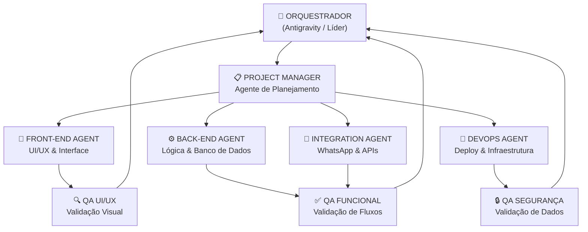
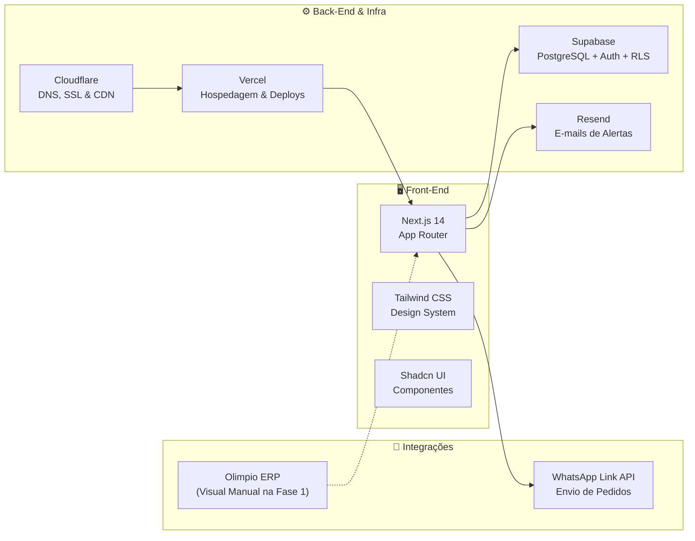

# Workflow de Execução — Projeto Donna FIT
**Sistema Multi-Agente Orquestrado | Fase 1: MVP Operacional ("Recuperando seu Tempo")**

---

## Visão Geral do Time

---

## Definição dos Agentes

| Agente | Papel | Skills Necessárias |
| :--- | :--- | :--- |
| 🧠 **Orquestrador** | Líder do projeto. Define prioridades, resolve conflitos e aprova entregas. | Visão sistêmica, tomada de decisão, comunicação com cliente. |
| 📋 **Project Manager** | Gerencia o cronograma, checklists e documentação. | Planejamento de sprints, rastreamento de tarefas, comunicação entre agentes. |
| 🎨 **Front-End Agent** | Constrói toda a interface visual e experiência do usuário. | HTML, CSS, JavaScript/TypeScript, React/Next.js, Design System, Responsividade. |
| ⚙️ **Back-End Agent** | Constrói a lógica de negócio, banco de dados e APIs. | Node.js, Supabase (PostgreSQL), REST API, Regras de Negócio, RLS (Row Level Security). |
| 🔗 **Integration Agent** | Conecta o sistema ao WhatsApp e setups de e-mail/infraestrutura. | WhatsApp API/Link, Resend integration, Webhooks. |
| 🚀 **DevOps Agent** | Faz o deploy e garante a disponibilidade do sistema usando as novas contas de nuvem. | Vercel, GitHub Actions CI/CD, Cloudflare, Registro.br DNS. |
| 🔍 **QA UI/UX** | Valida a interface visual, responsividade e experiência. | Testes visuais, compatibilidade mobile/tablet/PC. |
| ✅ **QA Funcional** | Valida os fluxos de uso de ponta a ponta. | Teste de casos de uso, edge cases, relatório de bugs. |
| 🔒 **QA Segurança** | Valida autenticação, permissões e exposição de dados. | Teste de autenticação, RLS, Exposição de endpoints. |

---

## Fluxo de Execução por Fase (Milestones do Contrato)

```mermaid
flowchart TD
    START([🚀 M0 — Kickoff Assinado]) --> M1
    
    subgraph M1["📂 M1 — Setup de Infraestrutura & Banco de Dados"]
        M1A["PM: Configurar repositório GitHub e CI/CD"]
        M1B["DEVOPS: Configurar DNS Registro.br + Cloudflare + Vercel"]
        M1C["BACK-END: Modelar Schema PostgreSQL no Supabase + RLS"]
        M1D["FRONT-END: Setup do Next.js + Design Tokens de ID Visual"]
        M1A --> M1B & M1C & M1D
    end

    M1 --> GATE0{{"🔒 GATE 0\nQA Segurança:\nAmbientes OK?\nSchema importado?"}}
    GATE0 -->|Falha| M1
    GATE0 -->|Aprovado| M2

    subgraph M2["🛒 M2 — Cardápio Digital & Checkout"]
        M2A["FRONT-END: Listagem categorizada de 40+ SKUs"]
        M2B["FRONT-END: Carrinho de Compras responsivo"]
        M2C["INTEGRATION: Geração de link formatado WhatsApp + ID Único"]
        M2D["BACK-END: Relação de combos e avulsos no DB"]
        M2A & M2B --> M2C & M2D
    end

    M2 --> GATE1{{"🔍 GATE 1\nQA UI/UX: Mobile e Tablet OK?\nQA Funcional: Pedido chega no WhatsApp?"}}
    GATE1 -->|Falha| M2
    GATE1 -->|Aprovado| M3

    subgraph M3["📋 M3 — Painel de Gestão de Pedidos (Everson)"]
        M3A["BACK-END: Websockets / Real-time para novos pedidos"]
        M3B["FRONT-END: Painel Admin com Kanban de status operacionais"]
        M3C["FRONT-END: Visualização rápida para 'copiar dados para Olimpio ERP'"]
        M3A --> M3B & M3C
    end

    M3 --> GATE2{{"✅ GATE 2\nQA Funcional:\nAtualização real-time < 3s?\nFácil visualização fiscal?"}}
    GATE2 -->|Falha| M3
    GATE2 -->|Aprovado| M4

    subgraph M4["🍳 M4 — Cozinha & Estoque (Patricia)"]
        M4A["FRONT-END: Dashboard de Produção D+1 consolidado"]
        M4B["FRONT-END: Tela de Ajuste Rápido de Freezer (Contagem Física)"]
        M4C["BACK-END: Baixa automática de estoque no pedido + Alerta crítico"]
        M4A --> M4B & M4C
    end

    M4 --> GATE3{{"✅ GATE 3\nQA Funcional: Ajuste do freezer reflete no site?\nQA UI/UX: Legibilidade do painel na cozinha"}}
    GATE3 -->|Falha| M4
    GATE3 -->|Aprovado| M5

    subgraph M5["🧪 M5 — Testes Assistidos em Homologação"]
        M5A["QA FUNCIONAL: Simulação real de 100+ pedidos com a equipe"]
        M5B["FRONT-END: Ajustes de usabilidade e performance (Lighthouse)"]
        M5C["BACK-END: Validação de consistência do banco sob stress"]
        M5A --> M5B & M5C
    end

    M5 --> GATE4{{"🔒 GATE 4\nSócios assinam homologação?\nErros zerados?"}}
    GATE4 -->|Falha| M5
    GATE4 -->|Aprovado| M6

    subgraph M6["🚀 M6 — Go-Live & Treinamento Final"]
        M6A["DEVOPS: Publicação definitiva no domínio oficial (Registro.br)"]
        M6B["INTEGRATION: Ativação do e-mail transacional (Resend)"]
        M6C["FRONT-END: Geração de QR Code de Rótulos apontando para novo site"]
        M6D["PM: Treinamento prático de Everson e Patricia"]
        M6A & M6B --> M6C --> M6D
    end

    M6 --> GOLIVE([🎉 GO-LIVE — Donna FIT Ativa!])
```

---

## Roadmap da Fase 2 — Gestão e Inteligência

Após a consolidação da Fase 1, a **Fase 2** trará automação profunda e roteirização:
1. **Sistema de Rota Inteligente (Smart Routing):** Ordenação automática de trajetos de entrega no painel do motorista, gerando links dinâmicos para Waze/Google Maps sem digitação de endereços.
2. **Integração de Notas Fiscais:** Conexão direta com API para emissão automática de NF-e/NFC-e eliminando o retrabalho manual no Olimpio ERP.
3. **Integração de Pagamento Online (Asaas):** Link de pagamento PIX e Cartão nativos, com conciliação automática no banco de dados.
4. **Fichas Técnicas e Compras Inteligentes:** Controle exato de custos de insumo com base na produção planejada.

---

## Critérios de Execução Primorosa

### 🔒 M1 — Setup de Infraestrutura
* **Tabelas do Banco de Dados:** Criadas perfeitamente com RLS ativo no **Supabase**.
* **Configuração DNS:** Domínio configurado via **Cloudflare** com SSL ativo e proxy ativado para proteção e velocidade.
* **Repositório:** Branch `main` protegida no **GitHub** com deploys contínuos configurados na **Vercel** (Staging/Production).

### 🔍 M2 — Cardápio & Checkout
* **Design Responsivo:** Funcionamento primoroso em dispositivos mobile (375px) a telas 4K.
* **Segurança no Checkout:** Validação robusta de telefone e nome no cliente e servidor.
* **WhatsApp Link:** Mensagens formatadas elegantes e limpas enviadas com ID único `#DFXXXX`.

### ✅ M3 — Gestão de Pedidos (Everson)
* **Real-time:** Pedido recebido pisca na tela e emite alerta sonoro de aviso imediato.
* **Praticidade Fiscal:** Painel contém botão de "Copiar Dados Fiscais" para facilitar a emissão manual do Olimpio ERP antes do cupom de impressora USB.

### ✅ M4 — Cozinha & Estoque (Patricia)
* **Ajuste de Freezer:** A Patricia insere a contagem física do freezer em < 30 segundos, atualizando instantaneamente a disponibilidade para os clientes no Cardápio Digital.
* **Visão Cozinha D+1:** Agrupamento de SKUs em fonte grande (mínimo 18px) facilitando leitura a 2 metros de distância na bancada de inox.

---

## Stack Tecnológica Oficial (Fase 1)

---

*Workflow atualizado e estruturado de acordo com o contrato assinado — Versão 2.0 | Projeto Donna FIT.*
